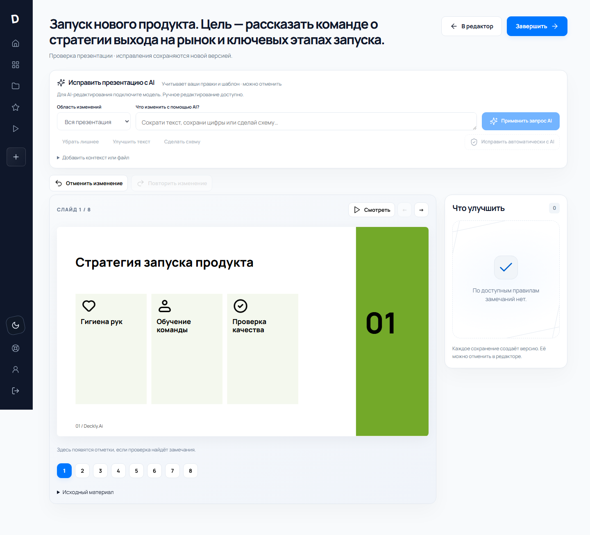
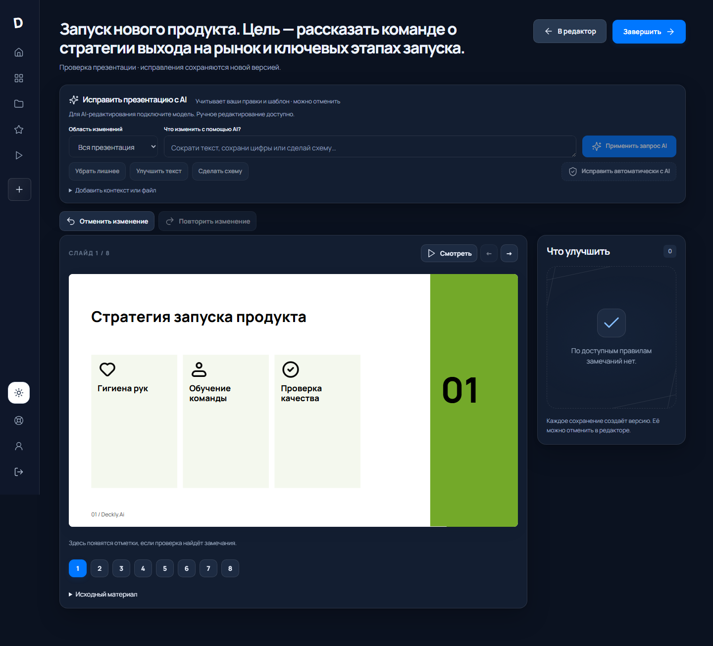

# Deckly.Ai

### Из материалов — в историю, которую хочется показать.

[](backend/requirements.txt)
[](frontend/package.json)
[](frontend/package.json)
[](docs/ARCHITECTURE.md)

AI-помощник для презентаций: ваш материал, ваш шаблон, три варианта оформления — и редактируемый результат.

**[Быстрый запуск](#запуск-через-docker)** · **[Linux](#linux-без-docker)** · **[Qwen3.8-27B и интеграции](docs/INTEGRATIONS.md)** · **[Архитектура](docs/ARCHITECTURE.md)** · **[Как устроен код](docs/CODE_GUIDE.md)**

| Материал | Оформление | Готовый результат |
| :--- | :--- | :--- |
| Текст, документы, таблицы и исходный PPTX | Три композиции, AI-правки, аудит и отмена | Нативный PPTX, PDF, HTML и Яндекс.Диск |
| Числа из источника, без придуманных рядов | Светлая и тёмная темы, крупный предпросмотр | Редактируемые таблицы, графики и схемы |



<details>
<summary>Тёмная тема</summary>



</details>

*Скриншоты демонстрационного проекта с синтетическими данными. Для AI-редактирования подключите модель.*

Рабочее приложение: React + TypeScript + CSS, сервер Python/FastAPI, база SQLite. Node.js используется для сборки интерфейса. FastAPI — веб-фреймворк, а не база данных.

## Запуск после скачивания с GitHub

Нужны Python 3.11–3.13 и Node.js 22.12+ с pnpm. Python 3.14 пока не используйте: часть бинарных зависимостей FastAPI/Pydantic может установиться несовместимо. Секреты храните только в `backend/.env`; этот файл намеренно не публикуется в GitHub.

Из папки проекта в PowerShell:

```powershell
cd frontend
pnpm install --frozen-lockfile
pnpm build
cd ..

cd backend
py -3.12 -m venv .venv
.\.venv\Scripts\python.exe -m pip install -r requirements.txt
Copy-Item .env.example .env
.\.venv\Scripts\python.exe -m uvicorn app.main:app --host 127.0.0.1 --port 8000 --no-access-log
```

Если команда `py -3.12` не найдена, установите Python 3.12 или 3.13 с https://www.python.org/downloads/windows/, закройте PowerShell, откройте заново и повторите команды.

Если `.env` уже настроен, не перезаписывайте его. Откройте http://127.0.0.1:8000. Создайте свой аккаунт. Учётные записи, презентации, версии, задания и избранное сохраняются в `backend/data/deckly.sqlite3`. Загруженные PPTX — в `backend/data/templates/`. Исходные три шаблона VK приложены; оригиналы не изменяются.

На текущем компьютере уже подготовлена `.venv` и собран интерфейс. Повторный запуск: `Start-Deckly.ps1` из папки проекта. Скрипт не меняет `.env` и не устанавливает пакеты автоматически.

## Запуск через Docker

Нужны Docker Engine/Desktop с поддержкой Docker Compose. Из корня проекта:

```sh
cp .env.docker.example .env.docker
docker compose up --build -d
```

Откройте http://127.0.0.1:8000. Проверка состояния: `docker compose ps` и `curl http://127.0.0.1:8000/api/health`. SQLite и пользовательские файлы хранятся в постоянном томе `deckly-data`; штатные PPTX-шаблоны копируются в него при первом старте. Для остановки выполните `docker compose down`. Чтобы удалить и контейнер, и все сохранённые данные, отдельно выполните `docker compose down -v`.

Секреты интеграций указывайте только в локальном `.env.docker` (он исключён из Git и Docker build context). Для production нужны публичный HTTPS `PUBLIC_BASE_URL`, соответствующий HTTPS `CORS_ORIGINS`, `COOKIE_SECURE=true`, SMTP для подтверждения почты и настройки модели; не публикуйте контейнер без этих параметров и TLS reverse proxy. Локальный Compose привязывает порт только к `127.0.0.1`.

## Что работает

- Регистрация по почте, вход и выход; пароли хешируются scrypt. Серверная сессия хранится в HttpOnly-cookie. Данные разных аккаунтов изолированы.
- Яндекс ID: серверный OAuth Authorization Code + PKCE и одноразовый state. Требуется ваше OAuth-приложение.
- Каталог: три исходных VK-шаблона и шесть авторских тем, поиск, категории, избранное в БД, загрузка нового PPTX.
- Материал → редактируемая структура → три композиции с одинаковым содержанием → редактор → аудит → экспорт.
- Редактор текста, тезисов, заметок, таблиц и диаграмм. Версии, отмена сохранения, предупреждение об уходе с несохранёнными изменениями.
- Проверка геометрии, переполнения, контраста, плотности текста и точного совпадения цитат. Смысловая проверка включается с LLM.
- Нативные редактируемые объекты PPTX; отдельные PDF и HTML. Отрицательные значения диаграмм учитываются.
- На странице поддержки можно отправить обращение по email через защищённую форму.
- Qwen3.8-27B выбирает представление: таблица, график, схема или иконки. Новые числовые ряды проверяются по исходнику; неподтверждённые данные отклоняются.
- Яндекс.Диск: сохранение выбранного варианта в настоящий PPTX через OAuth, проверка размера и MD5 перед подтверждением.

## Linux без Docker

Нужны Python 3.12, Node.js 22.12+ и pnpm. На Ubuntu 24.04 / Debian с подходящим Python:

```sh
sudo apt-get update
sudo apt-get install -y python3-venv libreoffice-impress poppler-utils fonts-dejavu-core fonts-liberation
cd frontend
pnpm install --frozen-lockfile
pnpm build
cd ../backend
python3 -m venv .venv
.venv/bin/python -m pip install -r requirements.txt
cp -n .env.example .env
.venv/bin/python -m uvicorn app.main:app --host 127.0.0.1 --port 8000 --no-access-log
```

LibreOffice и Poppler нужны для реального предпросмотра первого слайда PPTX. Установите также шрифты вашего шаблона с учётом их лицензий. Docker-образ уже включает конвертер и базовые шрифты. Без конвертера используется встроенная миниатюра документа, если она есть; иначе показывается нейтральная карточка «Новый шаблон». Сбой превью не мешает использовать шаблон. Кэш привязан к содержимому файла и версии нормализации; исходник не меняется.

## Подключение модели

В `backend/.env` заполните:

```dotenv
LLM_MODE=live
OPENROUTER_BASE_URL=https://openrouter.ai/api/v1
OPENROUTER_API_KEY=YOUR_OPENROUTER_KEY
OPENROUTER_MODEL=qwen/qwen3.8-27b
OPENROUTER_HTTP_REFERER=http://127.0.0.1:8000
LLM_MAX_TOKENS=8000
```

Нужен совместимый `POST /v1/chat/completions`. Вызов находится в `backend/app/services/llm.py`; промпты — в `backend/prompts/`. Ключ никогда не встраивается в React и не возвращается браузеру. После изменения `.env` перезапустите сервер. Если провайдер не поддерживает `response_format`, поставьте `LLM_JSON_MODE=false`.

Для собственного OpenAI-совместимого endpoint задайте `LLM_BASE_URL`, `LLM_MODEL=Qwen/Qwen3.8-27B`, `LLM_API_KEY`. Явный `LLM_BASE_URL` переключает **весь** набор параметров: ключ OpenRouter не отправится другому провайдеру. Qwen получает отдельные системные ограничения и данные пользователя. Цвета и геометрию проверяет Python, а не модель. Ограничения визуализаций — в [INTEGRATIONS.md](docs/INTEGRATIONS.md).

По умолчанию `LLM_MODE=demo`: готовый пример и разбиение текста на абзацы без запроса к модели. Это явно обозначено в интерфейсе. Для реальной генерации нужны ваш ключ/сервер и модель. Реальная генерация проверена 27.09.2026: 10 слайдов, три оформления и девять экспортов за 33,72 секунды. Условия и ограничения прогона — в [VALIDATION.md](docs/VALIDATION.md).

## Яндекс ID

Создайте приложение на https://oauth.yandex.ru с правами `login:info` и `login:email`. Redirect URI в кабинете и `.env` должны совпадать:

```dotenv
YANDEX_CLIENT_ID=YOUR_CLIENT_ID
# Секретный ключ необязателен: используется PKCE S256.
YANDEX_CLIENT_SECRET=
YANDEX_REDIRECT_URI=http://127.0.0.1:8000/api/auth/yandex/callback
PUBLIC_BASE_URL=http://127.0.0.1:8000
```

Если кабинет Яндекса требует HTTPS для выбранного типа приложения, используйте ваш HTTPS-домен и обновите оба адреса. Реальный вход требует зарегистрированного приложения; в этой сборке проверены тестовые ответы и защита state/PKCE. Совпадение почты не связывает автоматически локальный аккаунт и Яндекс ID. Яндекс можно явно привязать в профиле: «Вход и безопасность». Пошаговая настройка: [YANDEX_ID.md](docs/YANDEX_ID.md).

Официальная документация: [получение кода и PKCE](https://yandex.ru/dev/id/doc/ru/codes/code-url), [профиль пользователя](https://yandex.ru/dev/id/doc/ru/user-information).

## Подтверждение email

Регистрация по email требует подтверждения адреса. В development без SMTP ссылка не отправляется и не записывается в логи; настройте SMTP, чтобы завершить подтверждение. Для почты Яндекса задайте `SMTP_HOST=smtp.yandex.ru`, `SMTP_PORT=465`, `SMTP_USERNAME`, `SMTP_PASSWORD` (пароль приложения, не пароль аккаунта) и `EMAIL_FROM` в серверном `.env` или `.env.docker`. Ссылка подтверждения действует 24 часа и используется один раз. Повторная отправка и погашение ссылки ограничены по частоте; ответ на повторную отправку не раскрывает состояние аккаунта.

### Восстановление пароля

На экране входа нажмите «Забыли пароль?», укажите адрес и откройте ссылку из письма. Ответ API нейтральный и не сообщает, зарегистрирован ли адрес. Ссылка действует 1 час, погашается один раз; в SQLite хранится только SHA-256-хеш токена. После сброса все активные сессии аккаунта отзываются. Для отправки писем необходимы SMTP-параметры выше. Секреты и ссылки с токенами не включайте в логи или Git.

Форма «Поддержка» отправляет обращения на `SUPPORT_TO` (если пусто — `EMAIL_FROM`); `From` остаётся серверным адресом, адрес пользователя — только `Reply-To`. `SMTP_SECURITY=auto` выбирает STARTTLS для порта 587, SSL для остальных; также доступны явные `ssl`/`starttls`. Успех означает приём SMTP-сервером, а не гарантию попадания во входящие. Ошибки не показываются как успех и не расходуют длинную квоту; короткая защита от частых запросов остаётся. `SUPPORT_RATE_LIMIT` по умолчанию: 5 обращений за 15 минут в production, 30 в development.

## Сохранение на Яндекс.Диск

Добавьте право `cloud_api:disk.app_folder` в приложение Яндекс OAuth и задайте серверный `YANDEX_DISK_TOKEN_KEY` — постоянный ключ Fernet. На финальном шаге нажмите «Подключить Яндекс.Диск», затем «Сохранить на Яндекс.Диск». Каждое сохранение создаёт новый PPTX в папке приложения `Deckly`; существующие файлы не перезаписываются. История проекта остаётся в локальной SQLite. Подробная [настройка OAuth, шифрования и обработка ошибок](docs/INTEGRATIONS.md#яндексдиск).

Это экспорт файла, не резервная копия всей базы. Старые PostgreSQL backup API оставлены совместимыми, но не выдаются за Яндекс.Диск; сохранённые ранее данные не удаляются.

## Как понять и изменить код

Начните с [docs/CODE_GUIDE.md](docs/CODE_GUIDE.md). Там разобран путь одного запроса и перечислены файлы для каждой правки. [docs/ARCHITECTURE.md](docs/ARCHITECTURE.md) описывает хранение и сборку слайдов, [docs/AUDIT.md](docs/AUDIT.md) — реальные проверки, [docs/MODELS.md](docs/MODELS.md) — модель и ограничения ТЗ.

Режим разработки интерфейса (Node.js 22.12+ и pnpm):

```powershell
cd frontend
pnpm install --frozen-lockfile
pnpm dev
```

Python-сервер должен работать на 8000; Vite на 5173 проксирует `/api`. Для проверки OAuth удобнее готовая сборка на 8000. Пересборка: `pnpm build`. Форматирование: `pnpm exec prettier --write src`.

## Проверка

В интерфейсе обновлены FAQ, диалоги, этапы создания, выбор аудитории и количества слайдов, редактор структуры и три варианта оформления. На этапе оформления можно запросить новую композицию с пожеланиями: `POST /api/projects/{id}/regenerate` запускает фоновое задание с обычным опросом `/api/jobs/{id}`. В режиме `live` модель выбирает валидируемые параметры композиции; текст, данные и исходная презентация сохраняются. Результат создаётся отдельной презентацией только после успешной проверки. В `demo` доступны новые композиции по правилам без применения свободных пожеланий.

Редактор, проверка и финальный экран поддерживают просмотр презентации на всё окно, переключение стрелками и выход по Escape. Кнопка «На весь экран» использует Fullscreen API; если браузер его запрещает, остаётся просмотр на всю область окна. Маркеры замечаний привязаны к геометрии актуальных объектов и пересчитываются при изменении размеров. Замечания без связанного объекта доступны в списке.

```powershell
cd backend
.\.venv\Scripts\python.exe -m pytest -q
```

Проверка интерфейса и расположения маркеров:

```powershell
cd frontend
npm test
npm run build
npm run test:e2e
```

Браузерные E2E используют Chromium и поднимают отдельные FastAPI/Vite на портах 8183/5183 с одноразовой SQLite и тестовым хранилищем в уникальной временной папке. Внешние почта, OAuth, облачная БД и генератор изображений отключены в этом тестовом сервере. Установите браузер перед первым прогоном командой `pnpm exec playwright install chromium`. Python выбирается автоматически: `backend/.venv/Scripts/python.exe` на Windows, `backend/.venv/bin/python` на Linux/macOS; другой путь можно указать через `DECKLY_TEST_PYTHON`. Ошибки сохраняют screenshot, video и trace в `frontend/test-results/`; интерактивный HTML-отчёт: `pnpm exec playwright show-report`.

Тесты используют временную отдельную БД. Они не удаляют ваши аккаунты и презентации. Проверяются сессии, CSRF, изоляция аккаунтов, избранное, новый шаблон 4:3, аудит/отмена, LLM/OAuth с тестовыми ответами и девять редактируемых PPTX на трёх исходных шаблонах. Список ручных проверок — [docs/VALIDATION.md](docs/VALIDATION.md).

## Требования хакатона

Добавлены пакет материалов (TXT, MD, CSV, DOCX, PDF), назначение презентации, линейные/столбчатые диаграммы, процессы, циклы, иерархии и пиктограммы. Новые генерации получают сохраняемый паспорт с версиями промптов и компонентов, временем, шаблоном и аудитом всех трёх вариантов. В интерфейсе описание доступно из поддержки и мастера создания: «Как устроен Deckly».

Подробное соответствие, оси различий вариантов и настройка дополнительной FLUX.1-schnell (12B): [docs/REQUIREMENTS.md](docs/REQUIREMENTS.md). Полная генерация и регенерация ограничены 300 с вместе с очередью; отдельные AI-операции не имеют общего бизнес-дедлайна, но сохраняют сетевые таймауты и кнопку Stop. Подробности: [AI_OPERATIONS.md](docs/AI_OPERATIONS.md). Проверка реальной модели на синтетическом материале: `backend/.venv/Scripts/python.exe scripts/validate_generation.py --live` из корня проекта.

## Честные границы реализации

PPTX сохраняет мастера, макеты, ресурсы и исходное имя шрифта. Браузер, PDF и HTML показывают схему размещения с Manrope без графики мастеров. Это не обещание пиксельного совпадения с PowerPoint. Сложные мастера, SmartArt, анимации и непривычные шаблоны требуют визуальной проверки. Схемы экспортируются фигурами и соединителями, а не встроенным SmartArt-объектом. Генерация изображений требует отдельного FLUX-сервиса; смысловая проверка — подключённой LLM.

Перед публичным запуском задайте `APP_ENV=production`, HTTPS-адрес в `PUBLIC_BASE_URL`, только HTTPS origins в `CORS_ORIGINS` (включая публичный адрес), `COOKIE_SECURE=true`, SMTP-параметры для подтверждения email/сброса пароля и `LLM_MODE=live` с серверным `OPENROUTER_API_KEY`. Production-конфигурация проверяется при запуске до инициализации БД; намеренный demo требует `ALLOW_DEMO_IN_PRODUCTION=true`. При включённом OAuth Яндекса callback должен быть HTTPS на том же хосте. Эксплуатационный чек-лист, включая резервное копирование и реагирование на инциденты: [docs/VALIDATION.md](docs/VALIDATION.md). Запускайте один процесс сервера: задания хранят payload и после рестарта отмечаются как повторяемые; если результат не удалось забрать в открытой сессии, мастер создания может повторно подключиться к заданию. Уже выполненные результаты и исходные презентации при retry не дублируются. Для старых jobs без сохранённого payload нужно создать презентацию заново; очередь и многопроцессный запуск не поддерживаются.

Материалы для Figma поставляются **отдельным архивом**. В интерфейсе сайта нет раздела экспорта дизайна. Изменения в Figma не синхронизируются с кодом автоматически.
